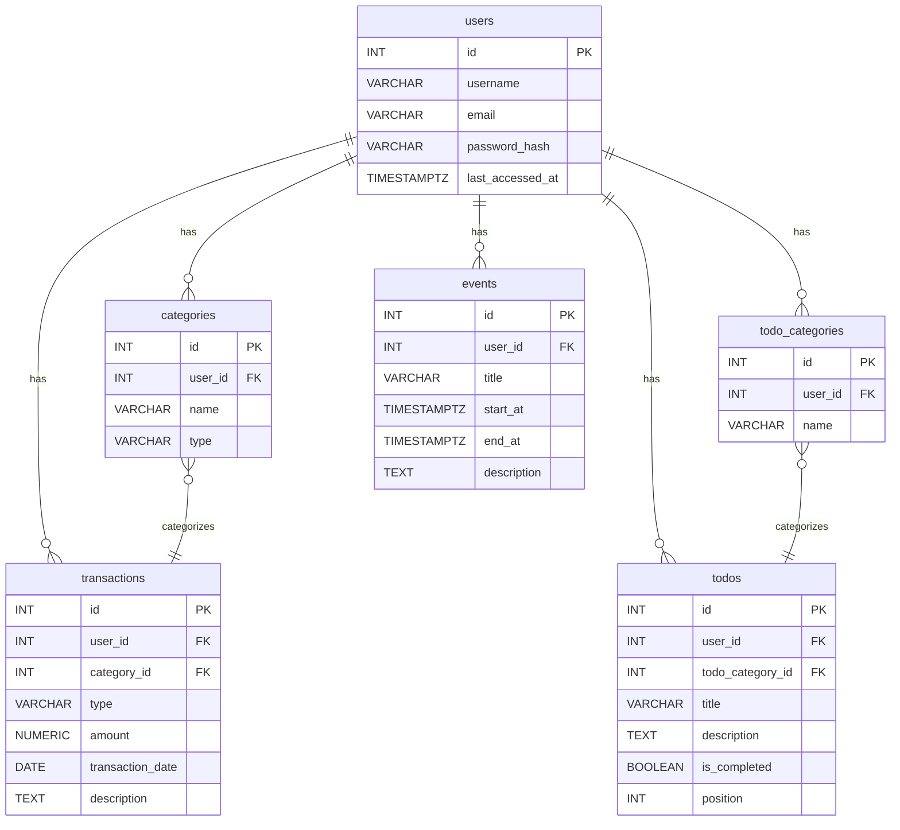

# データベーススキーマ定義

このドキュメントは、プロジェクトで使用されるPostgreSQLデータベースのテーブル構造とリレーションシップを定義します。

## ER図 (概念)

---

## テーブル定義

### `users`

ユーザーアカウントの基本情報を格納します。

| カラム名 | データ型 | 説明 | 制約 |
| :--- | :--- | :--- | :--- |
| `id` | `SERIAL` | 主キー | `PRIMARY KEY` |
| `username` | `VARCHAR` | ユーザー名 | `UNIQUE`, `NOT NULL` |
| `email` | `VARCHAR` | メールアドレス | `UNIQUE`, `NOT NULL` |
| `password_hash` | `VARCHAR` | ハッシュ化されたパスワード | `NOT NULL` |
| `last_accessed_at`| `TIMESTAMPTZ` | 最終アクセス日時 | |
| `created_at` | `TIMESTAMPTZ` | 作成日時 | `DEFAULT NOW()` |
| `updated_at` | `TIMESTAMPTZ` | 更新日時 | `DEFAULT NOW()` |

### `categories`

家計簿機能で使われる収入・支出のカテゴリーを管理します。

| カラム名 | データ型 | 説明 | 制約 |
| :--- | :--- | :--- | :--- |
| `id` | `SERIAL` | 主キー | `PRIMARY KEY` |
| `user_id` | `INTEGER` | ユーザーID | `FK (users.id)` |
| `name` | `VARCHAR` | カテゴリー名 | `NOT NULL` |
| `type` | `VARCHAR` | 種類 (`income` または `expense`) | `NOT NULL` |
| `created_at` | `TIMESTAMPTZ` | 作成日時 | `DEFAULT NOW()` |
| `updated_at` | `TIMESTAMPTZ` | 更新日時 | `DEFAULT NOW()` |

**複合ユニーク制約:** `(user_id, name)`

### `transactions`

家計簿の個々の取引（収入・支出）を記録します。

| カラム名 | データ型 | 説明 | 制約 |
| :--- | :--- | :--- | :--- |
| `id` | `SERIAL` | 主キー | `PRIMARY KEY` |
| `user_id` | `INTEGER` | ユーザーID | `FK (users.id)` |
| `category_id` | `INTEGER` | カテゴリーID | `FK (categories.id)` |
| `type` | `VARCHAR` | 種類 (`income` または `expense`) | `NOT NULL` |
| `amount` | `NUMERIC` | 金額 | `NOT NULL` |
| `transaction_date`| `DATE` | 取引日 | `NOT NULL` |
| `description` | `TEXT` | メモ | |
| `created_at` | `TIMESTAMPTZ` | 作成日時 | `DEFAULT NOW()` |
| `updated_at` | `TIMESTAMPTZ` | 更新日時 | `DEFAULT NOW()` |

### `todo_categories`

ToDoリスト機能で使われるカテゴリーを管理します。

| カラム名 | データ型 | 説明 | 制約 |
| :--- | :--- | :--- | :--- |
| `id` | `SERIAL` | 主キー | `PRIMARY KEY` |
| `user_id` | `INTEGER` | ユーザーID | `FK (users.id)` |
| `name` | `VARCHAR` | カテゴリー名 | `NOT NULL` |
| `created_at` | `TIMESTAMPTZ` | 作成日時 | `DEFAULT NOW()` |
| `updated_at` | `TIMESTAMPTZ` | 更新日時 | `DEFAULT NOW()` |

**複合ユニーク制約:** `(user_id, name)`

### `todos`

ToDoリストの各タスクを記録します。

| カラム名 | データ型 | 説明 | 制約 |
| :--- | :--- | :--- | :--- |
| `id` | `SERIAL` | 主キー | `PRIMARY KEY` |
| `user_id` | `INTEGER` | ユーザーID | `FK (users.id)` |
| `todo_category_id`| `INTEGER` | ToDoカテゴリーID | `FK (todo_categories.id)` |
| `title` | `VARCHAR` | タスクのタイトル | `NOT NULL` |
| `description` | `TEXT` | 詳細な説明 | |
| `is_completed` | `BOOLEAN` | 完了フラグ | `DEFAULT false` |
| `position` | `INTEGER` | 表示順序 (D&D用) | |
| `priority` | `INTEGER` | 優先度 (未使用) | |
| `due_date` | `DATE` | 期限日 (未使用) | |
| `created_at` | `TIMESTAMPTZ` | 作成日時 | `DEFAULT NOW()` |
| `updated_at` | `TIMESTAMPTZ` | 更新日時 | `DEFAULT NOW()` |

### `events`

カレンダーのイベント情報を記録します。

| カラム名 | データ型 | 説明 | 制約 |
| :--- | :--- | :--- | :--- |
| `id` | `SERIAL` | 主キー | `PRIMARY KEY` |
| `user_id` | `INTEGER` | ユーザーID | `FK (users.id)` |
| `title` | `VARCHAR` | イベントのタイトル | `NOT NULL` |
| `start_at` | `TIMESTAMPTZ` | 開始日時 | `NOT NULL` |
| `end_at` | `TIMESTAMPTZ` | 終了日時 | `NOT NULL` |
| `location` | `TEXT` | 場所 | |
| `description` | `TEXT` | 詳細 | |
| `is_recurring` | `BOOLEAN` | 繰り返しフラグ | `DEFAULT false` |
| `recurrence_rule` | `TEXT` | 繰り返しルール (iCalendar形式など) | |
| `created_at` | `TIMESTAMPTZ` | 作成日時 | `DEFAULT NOW()` |
| `updated_at` | `TIMESTAMPTZ` | 更新日時 | `DEFAULT NOW()` |
