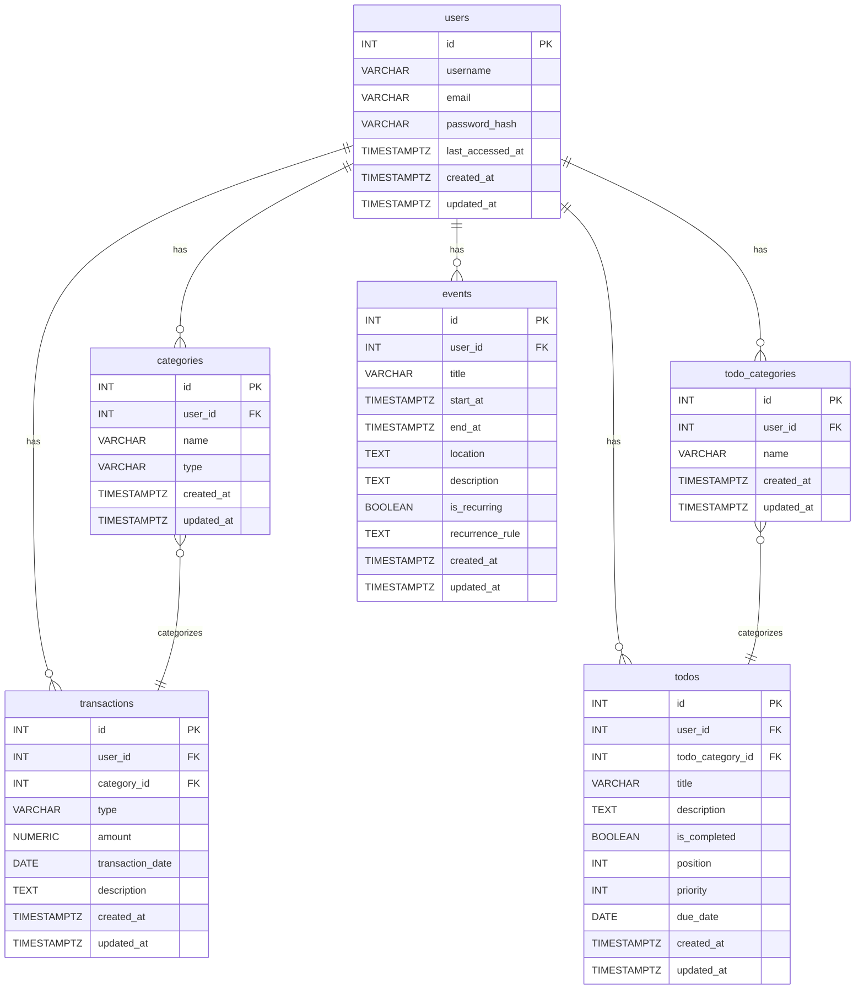

# Database Schema Definition / データベーススキーマ定義

This document defines the table structure and relationships of the PostgreSQL database used in the project.

このドキュメントは、プロジェクトで使用されるPostgreSQLデータベースのテーブル構造とリレーションシップを定義します。

## ER Diagram (Conceptual) / ER図 (概念)



---

## Table Definitions / テーブル定義

### `users`

Stores basic information about user accounts. / ユーザーアカウントの基本情報を格納します。

| Column Name / カラム名 | Data Type / データ型 | Description / 説明 | Constraints / 制約 |
| :--- | :--- | :--- | :--- |
| `id` | `SERIAL` | Primary key / 主キー | `PRIMARY KEY` |
| `username` | `VARCHAR(255)` | Username / ユーザー名 | `UNIQUE`, `NOT NULL` |
| `email` | `VARCHAR(255)` | Email address / メールアドレス | `UNIQUE`, `NOT NULL` |
| `password_hash` | `VARCHAR(255)` | Hashed password / ハッシュ化されたパスワード | `NOT NULL` |
| `last_accessed_at`| `TIMESTAMPTZ` | Last access time / 最終アクセス日時 | |
| `created_at` | `TIMESTAMPTZ` | Creation time / 作成日時 | `DEFAULT NOW()` |
| `updated_at` | `TIMESTAMPTZ` | Update time / 更新日時 | `DEFAULT NOW()` |

**Indexes / インデックス:**
- `users_username_idx` on `username`
- `users_email_idx` on `email`
- `users_last_accessed_at_idx` on `last_accessed_at`

**Notes / 特記事項:**
- Guest users are managed as `username = 'guest'` / ゲストユーザーは `username = 'guest'` として管理
- `password_hash` is hashed with bcrypt / `password_hash` は bcrypt でハッシュ化
- `last_accessed_at` is used for user activity monitoring / `last_accessed_at` は生存確認機能で使用

### `categories`

Manages income and expense categories used in the household budget feature. / 家計簿機能で使われる収入・支出のカテゴリーを管理します。

| Column Name / カラム名 | Data Type / データ型 | Description / 説明 | Constraints / 制約 |
| :--- | :--- | :--- | :--- |
| `id` | `SERIAL` | Primary key / 主キー | `PRIMARY KEY` |
| `user_id` | `INTEGER` | User ID / ユーザーID | `FK (users.id)`, `NOT NULL` |
| `name` | `VARCHAR(100)` | Category name / カテゴリー名 | `NOT NULL` |
| `type` | `VARCHAR(10)` | Type (`income` or `expense`) / 種類 (`income` または `expense`) | `NOT NULL` |
| `created_at` | `TIMESTAMPTZ` | Creation time / 作成日時 | `DEFAULT NOW()` |
| `updated_at` | `TIMESTAMPTZ` | Update time / 更新日時 | `DEFAULT NOW()` |

**Constraints / 制約:**
- `categories_user_id_name_key` UNIQUE(`user_id`, `name`)
- `categories_type_check` CHECK(`type` IN ('income', 'expense'))

**Indexes / インデックス:**
- `categories_user_id_idx` on `user_id`
- `categories_type_idx` on `type`

### `transactions`

Records individual transactions (income and expenses) in the household budget. / 家計簿の個々の取引（収入・支出）を記録します。

| Column Name / カラム名 | Data Type / データ型 | Description / 説明 | Constraints / 制約 |
| :--- | :--- | :--- | :--- |
| `id` | `SERIAL` | Primary key / 主キー | `PRIMARY KEY` |
| `user_id` | `INTEGER` | User ID / ユーザーID | `FK (users.id)`, `NOT NULL` |
| `category_id` | `INTEGER` | Category ID / カテゴリーID | `FK (categories.id)` |
| `type` | `VARCHAR(10)` | Type (`income` or `expense`) / 種類 (`income` または `expense`) | `NOT NULL` |
| `amount` | `NUMERIC(10,2)` | Amount / 金額 | `NOT NULL`, `CHECK (amount > 0)` |
| `transaction_date`| `DATE` | Transaction date / 取引日 | `NOT NULL` |
| `description` | `TEXT` | Notes / メモ | |
| `created_at` | `TIMESTAMPTZ` | Creation time / 作成日時 | `DEFAULT NOW()` |
| `updated_at` | `TIMESTAMPTZ` | Update time / 更新日時 | `DEFAULT NOW()` |

**Constraints / 制約:**
- `transactions_type_check` CHECK(`type` IN ('income', 'expense'))
- `transactions_amount_check` CHECK(`amount` > 0)

**Indexes / インデックス:**
- `transactions_user_id_idx` on `user_id`
- `transactions_transaction_date_idx` on `transaction_date`
- `transactions_type_idx` on `type`
- `transactions_user_id_date_idx` on (`user_id`, `transaction_date`)

**Notes / 特記事項:**
- Indexes optimized for monthly summary performance / 月次サマリー機能でパフォーマンス最適化のためインデックス設定
- Only positive amounts are allowed / 金額は正の値のみ許可

### `todo_categories`

Manages categories used in the ToDo list feature. / ToDoリスト機能で使われるカテゴリーを管理します。

| Column Name / カラム名 | Data Type / データ型 | Description / 説明 | Constraints / 制約 |
| :--- | :--- | :--- | :--- |
| `id` | `SERIAL` | Primary key / 主キー | `PRIMARY KEY` |
| `user_id` | `INTEGER` | User ID / ユーザーID | `FK (users.id)`, `NOT NULL` |
| `name` | `VARCHAR(100)` | Category name / カテゴリー名 | `NOT NULL` |
| `created_at` | `TIMESTAMPTZ` | Creation time / 作成日時 | `DEFAULT NOW()` |
| `updated_at` | `TIMESTAMPTZ` | Update time / 更新日時 | `DEFAULT NOW()` |

**Constraints / 制約:**
- `todo_categories_user_id_name_key` UNIQUE(`user_id`, `name`)

**Indexes / インデックス:**
- `todo_categories_user_id_idx` on `user_id`

### `todos`

Records each task in the ToDo list. / ToDoリストの各タスクを記録します。

| Column Name / カラム名 | Data Type / データ型 | Description / 説明 | Constraints / 制約 |
| :--- | :--- | :--- | :--- |
| `id` | `SERIAL` | Primary key / 主キー | `PRIMARY KEY` |
| `user_id` | `INTEGER` | User ID / ユーザーID | `FK (users.id)`, `NOT NULL` |
| `todo_category_id`| `INTEGER` | ToDo category ID / ToDoカテゴリーID | `FK (todo_categories.id)` |
| `title` | `VARCHAR(255)` | Task title / タスクのタイトル | `NOT NULL` |
| `description` | `TEXT` | Detailed description / 詳細な説明 | |
| `is_completed` | `BOOLEAN` | Completion flag / 完了フラグ | `DEFAULT false` |
| `position` | `INTEGER` | Display order (for drag & drop) / 表示順序 (ドラッグ&ドロップ用) | |
| `priority` | `INTEGER` | Priority (1=High, 2=Medium, 3=Low) / 優先度 (1=高, 2=中, 3=低) | |
| `due_date` | `DATE` | Due date / 期限日 | |
| `created_at` | `TIMESTAMPTZ` | Creation time / 作成日時 | `DEFAULT NOW()` |
| `updated_at` | `TIMESTAMPTZ` | Update time / 更新日時 | `DEFAULT NOW()` |

**Constraints / 制約:**
- `todos_priority_check` CHECK(`priority` IN (1, 2, 3))

**Indexes / インデックス:**
- `todos_user_id_idx` on `user_id`
- `todos_is_completed_idx` on `is_completed`
- `todos_priority_idx` on `priority`
- `todos_due_date_idx` on `due_date`
- `todos_user_id_completed_idx` on (`user_id`, `is_completed`)

**Notes / 特記事項:**
- `position` is used for UI drag & drop reordering / `position` は UI でのドラッグ&ドロップ並び替え機能で使用
- `priority` is used for priority ToDo list display / `priority` は優先ToDoリスト表示で使用

### `events`

Records calendar event information. / カレンダーのイベント情報を記録します。

| Column Name / カラム名 | Data Type / データ型 | Description / 説明 | Constraints / 制約 |
| :--- | :--- | :--- | :--- |
| `id` | `SERIAL` | Primary key / 主キー | `PRIMARY KEY` |
| `user_id` | `INTEGER` | User ID / ユーザーID | `FK (users.id)`, `NOT NULL` |
| `title` | `VARCHAR(255)` | Event title / イベントのタイトル | `NOT NULL` |
| `start_at` | `TIMESTAMPTZ` | Start time / 開始日時 | `NOT NULL` |
| `end_at` | `TIMESTAMPTZ` | End time / 終了日時 | `NOT NULL` |
| `location` | `TEXT` | Location / 場所 | |
| `description` | `TEXT` | Details / 詳細 | |
| `is_recurring` | `BOOLEAN` | Recurring flag / 繰り返しフラグ | `DEFAULT false` |
| `recurrence_rule` | `TEXT` | Recurrence rule (iCalendar format, etc.) / 繰り返しルール (iCalendar形式など) | |
| `created_at` | `TIMESTAMPTZ` | Creation time / 作成日時 | `DEFAULT NOW()` |
| `updated_at` | `TIMESTAMPTZ` | Update time / 更新日時 | `DEFAULT NOW()` |

**Constraints / 制約:**
- `events_time_check` CHECK(`end_at` > `start_at`)

**Indexes / インデックス:**
- `events_user_id_idx` on `user_id`
- `events_start_at_idx` on `start_at`
- `events_end_at_idx` on `end_at`
- `events_user_id_start_at_idx` on (`user_id`, `start_at`)

**Notes / 特記事項:**
- Indexes optimized for upcoming events retrieval / 今後の予定取得でパフォーマンス最適化のためインデックス設定
- `recurrence_rule` is for future recurring event implementation / `recurrence_rule` は将来の繰り返しイベント実装用

---

## Database Connection Configuration / データベース接続設定

### Connection Information / 接続情報

```javascript
// db.js
const pool = new Pool({
  user: process.env.DB_USER || 'postgres',
  host: process.env.DB_HOST || 'localhost',
  database: process.env.DB_NAME || 'minna_no_himitsukichi',
  password: process.env.DB_PASSWORD || 'password',
  port: process.env.DB_PORT || 5432,
});
```

### Environment Variables / 環境変数

| Variable Name / 変数名 | Description / 説明 | Default Value / デフォルト値 |
|--------|------|-------------|
| `DB_USER` | Database username / データベースユーザー名 | `postgres` |
| `DB_HOST` | Database host / データベースホスト | `localhost` |
| `DB_NAME` | Database name / データベース名 | `minna_no_himitsukichi` |
| `DB_PASSWORD` | Database password / データベースパスワード | `password` |
| `DB_PORT` | Database port / データベースポート | `5432` |

---

## Migration / マイグレーション

### Initial Setup / 初期セットアップ

```sql
-- Create database / データベース作成
CREATE DATABASE minna_no_himitsukichi;

-- Connect to the database / データベースに接続
\c minna_no_himitsukichi;

-- Required extensions / 必要な拡張機能
CREATE EXTENSION IF NOT EXISTS "uuid-ossp";
```

### Complete Table Creation Scripts / 完全なテーブル作成スクリプト

Execute in the following order considering dependencies: / 依存関係を考慮して以下の順序で実行:

#### 1. Users Table / ユーザーテーブル

```sql
-- Create users table / ユーザーテーブル作成
CREATE TABLE users (
    id SERIAL PRIMARY KEY,
    username VARCHAR(255) UNIQUE NOT NULL,
    email VARCHAR(255) UNIQUE NOT NULL,
    password_hash VARCHAR(255) NOT NULL,
    last_accessed_at TIMESTAMPTZ,
    created_at TIMESTAMPTZ DEFAULT NOW(),
    updated_at TIMESTAMPTZ DEFAULT NOW()
);

-- Create indexes for users / ユーザーテーブルのインデックス作成
CREATE INDEX users_username_idx ON users(username);
CREATE INDEX users_email_idx ON users(email);
CREATE INDEX users_last_accessed_at_idx ON users(last_accessed_at);
```

#### 2. Categories Table / カテゴリーテーブル

```sql
-- Create categories table / カテゴリーテーブル作成
CREATE TABLE categories (
    id SERIAL PRIMARY KEY,
    user_id INTEGER NOT NULL REFERENCES users(id) ON DELETE CASCADE,
    name VARCHAR(100) NOT NULL,
    type VARCHAR(10) NOT NULL CHECK (type IN ('income', 'expense')),
    created_at TIMESTAMPTZ DEFAULT NOW(),
    updated_at TIMESTAMPTZ DEFAULT NOW(),
    UNIQUE(user_id, name)
);

-- Create indexes for categories / カテゴリーテーブルのインデックス作成
CREATE INDEX categories_user_id_idx ON categories(user_id);
CREATE INDEX categories_type_idx ON categories(type);
```

#### 3. Todo Categories Table / Todoカテゴリーテーブル

```sql
-- Create todo_categories table / todo_categoriesテーブル作成
CREATE TABLE todo_categories (
    id SERIAL PRIMARY KEY,
    user_id INTEGER NOT NULL REFERENCES users(id) ON DELETE CASCADE,
    name VARCHAR(100) NOT NULL,
    created_at TIMESTAMPTZ DEFAULT NOW(),
    updated_at TIMESTAMPTZ DEFAULT NOW(),
    UNIQUE(user_id, name)
);

-- Create indexes for todo_categories / todo_categoriesテーブルのインデックス作成
CREATE INDEX todo_categories_user_id_idx ON todo_categories(user_id);
```

#### 4. Events Table / イベントテーブル

```sql
-- Create events table / イベントテーブル作成
CREATE TABLE events (
    id SERIAL PRIMARY KEY,
    user_id INTEGER NOT NULL REFERENCES users(id) ON DELETE CASCADE,
    title VARCHAR(255) NOT NULL,
    start_at TIMESTAMPTZ NOT NULL,
    end_at TIMESTAMPTZ NOT NULL,
    location TEXT,
    description TEXT,
    is_recurring BOOLEAN DEFAULT false,
    recurrence_rule TEXT,
    created_at TIMESTAMPTZ DEFAULT NOW(),
    updated_at TIMESTAMPTZ DEFAULT NOW(),
    CHECK (end_at > start_at)
);

-- Create indexes for events / イベントテーブルのインデックス作成
CREATE INDEX events_user_id_idx ON events(user_id);
CREATE INDEX events_start_at_idx ON events(start_at);
CREATE INDEX events_end_at_idx ON events(end_at);
CREATE INDEX events_user_id_start_at_idx ON events(user_id, start_at);
```

#### 5. Transactions Table / トランザクションテーブル

```sql
-- Create transactions table / トランザクションテーブル作成
CREATE TABLE transactions (
    id SERIAL PRIMARY KEY,
    user_id INTEGER NOT NULL REFERENCES users(id) ON DELETE CASCADE,
    category_id INTEGER REFERENCES categories(id) ON DELETE SET NULL,
    type VARCHAR(10) NOT NULL CHECK (type IN ('income', 'expense')),
    amount NUMERIC(10,2) NOT NULL CHECK (amount > 0),
    transaction_date DATE NOT NULL,
    description TEXT,
    created_at TIMESTAMPTZ DEFAULT NOW(),
    updated_at TIMESTAMPTZ DEFAULT NOW()
);

-- Create indexes for transactions / トランザクションテーブルのインデックス作成
CREATE INDEX transactions_user_id_idx ON transactions(user_id);
CREATE INDEX transactions_transaction_date_idx ON transactions(transaction_date);
CREATE INDEX transactions_type_idx ON transactions(type);
CREATE INDEX transactions_user_id_date_idx ON transactions(user_id, transaction_date);
```

#### 6. Todos Table / Todoテーブル

```sql
-- Create todos table / todosテーブル作成
CREATE TABLE todos (
    id SERIAL PRIMARY KEY,
    user_id INTEGER NOT NULL REFERENCES users(id) ON DELETE CASCADE,
    todo_category_id INTEGER REFERENCES todo_categories(id) ON DELETE SET NULL,
    title VARCHAR(255) NOT NULL,
    description TEXT,
    is_completed BOOLEAN DEFAULT false,
    position INTEGER,
    priority INTEGER CHECK (priority IN (1, 2, 3)),
    due_date DATE,
    created_at TIMESTAMPTZ DEFAULT NOW(),
    updated_at TIMESTAMPTZ DEFAULT NOW()
);

-- Create indexes for todos / todosテーブルのインデックス作成
CREATE INDEX todos_user_id_idx ON todos(user_id);
CREATE INDEX todos_is_completed_idx ON todos(is_completed);
CREATE INDEX todos_priority_idx ON todos(priority);
CREATE INDEX todos_due_date_idx ON todos(due_date);
CREATE INDEX todos_user_id_completed_idx ON todos(user_id, is_completed);
```

### Update Triggers / 更新トリガー

```sql
-- Function to update updated_at timestamp / updated_atタイムスタンプ更新関数
CREATE OR REPLACE FUNCTION update_updated_at_column()
RETURNS TRIGGER AS $$
BEGIN
    NEW.updated_at = NOW();
    RETURN NEW;
END;
$$ LANGUAGE plpgsql;

-- Create update triggers for all tables / 全テーブルに更新トリガー作成
CREATE TRIGGER update_users_updated_at BEFORE UPDATE ON users
    FOR EACH ROW EXECUTE FUNCTION update_updated_at_column();

CREATE TRIGGER update_categories_updated_at BEFORE UPDATE ON categories
    FOR EACH ROW EXECUTE FUNCTION update_updated_at_column();

CREATE TRIGGER update_todo_categories_updated_at BEFORE UPDATE ON todo_categories
    FOR EACH ROW EXECUTE FUNCTION update_updated_at_column();

CREATE TRIGGER update_events_updated_at BEFORE UPDATE ON events
    FOR EACH ROW EXECUTE FUNCTION update_updated_at_column();

CREATE TRIGGER update_transactions_updated_at BEFORE UPDATE ON transactions
    FOR EACH ROW EXECUTE FUNCTION update_updated_at_column();

CREATE TRIGGER update_todos_updated_at BEFORE UPDATE ON todos
    FOR EACH ROW EXECUTE FUNCTION update_updated_at_column();
```

### Initial Sample Data / 初期サンプルデータ

```sql
-- Create a sample user / サンプルユーザー作成
INSERT INTO users (username, email, password_hash) VALUES
('demo_user', 'demo@example.com', '$2b$10$example_hash_here');

-- Get the user ID for sample data / サンプルデータ用のユーザーID取得
-- Note: Replace 1 with actual user ID from above insert / 注意: 上記の挿入で得られた実際のユーザーIDに1を置き換えてください

-- Create default categories / デフォルトカテゴリー作成
INSERT INTO categories (user_id, name, type) VALUES
(1, '給与', 'income'),
(1, 'ボーナス', 'income'),
(1, '副業', 'income'),
(1, '食費', 'expense'),
(1, '交通費', 'expense'),
(1, '住居費', 'expense'),
(1, '光熱費', 'expense'),
(1, '通信費', 'expense'),
(1, '娯楽費', 'expense'),
(1, '医療費', 'expense');

-- Create default todo categories / デフォルトTodoカテゴリー作成
INSERT INTO todo_categories (user_id, name) VALUES
(1, '仕事'),
(1, '個人'),
(1, '買い物'),
(1, '勉強'),
(1, '健康');

-- Create sample transactions / サンプル取引作成
INSERT INTO transactions (user_id, category_id, type, amount, transaction_date, description) VALUES
(1, 1, 'income', 300000.00, CURRENT_DATE - INTERVAL '1 day', '月給'),
(1, 4, 'expense', 5000.00, CURRENT_DATE - INTERVAL '1 day', 'スーパーでの買い物'),
(1, 5, 'expense', 1200.00, CURRENT_DATE - INTERVAL '2 days', '電車代'),
(1, 6, 'expense', 80000.00, CURRENT_DATE - INTERVAL '3 days', '家賃');

-- Create sample todos / サンプルTodo作成
INSERT INTO todos (user_id, todo_category_id, title, description, priority, due_date) VALUES
(1, 1, 'プロジェクト資料作成', '来週のプレゼン用の資料を作成する', 1, CURRENT_DATE + INTERVAL '3 days'),
(1, 2, '歯医者の予約', '定期検診の予約を取る', 2, CURRENT_DATE + INTERVAL '1 week'),
(1, 3, '牛乳を買う', 'スーパーで牛乳を購入', 3, CURRENT_DATE + INTERVAL '1 day'),
(1, 4, 'オンライン講座受講', 'プログラミング講座の第3章を完了', 2, CURRENT_DATE + INTERVAL '5 days');

-- Create sample events / サンプルイベント作成
INSERT INTO events (user_id, title, start_at, end_at, location, description) VALUES
(1, 'チームミーティング',
 CURRENT_TIMESTAMP + INTERVAL '1 day' + INTERVAL '9 hours',
 CURRENT_TIMESTAMP + INTERVAL '1 day' + INTERVAL '10 hours',
 '会議室A', '週次チームミーティング'),
(1, 'ランチ',
 CURRENT_TIMESTAMP + INTERVAL '2 days' + INTERVAL '12 hours',
 CURRENT_TIMESTAMP + INTERVAL '2 days' + INTERVAL '13 hours',
 'レストランXYZ', '友人とのランチ');
```

### Verification Queries / 検証クエリ

```sql
-- Verify table creation / テーブル作成の確認
SELECT table_name FROM information_schema.tables
WHERE table_schema = 'public' AND table_type = 'BASE TABLE';

-- Check sample data / サンプルデータの確認
SELECT 'users' as table_name, COUNT(*) as count FROM users
UNION ALL
SELECT 'categories', COUNT(*) FROM categories
UNION ALL
SELECT 'todo_categories', COUNT(*) FROM todo_categories
UNION ALL
SELECT 'transactions', COUNT(*) FROM transactions
UNION ALL
SELECT 'todos', COUNT(*) FROM todos
UNION ALL
SELECT 'events', COUNT(*) FROM events;

-- Check foreign key constraints / 外部キー制約の確認
SELECT
    tc.table_name,
    kcu.column_name,
    ccu.table_name AS foreign_table_name,
    ccu.column_name AS foreign_column_name
FROM
    information_schema.table_constraints AS tc
    JOIN information_schema.key_column_usage AS kcu
      ON tc.constraint_name = kcu.constraint_name
      AND tc.table_schema = kcu.table_schema
    JOIN information_schema.constraint_column_usage AS ccu
      ON ccu.constraint_name = tc.constraint_name
      AND ccu.table_schema = tc.table_schema
WHERE tc.constraint_type = 'FOREIGN KEY' AND tc.table_schema='public';
```

---

## Performance Optimization / パフォーマンス最適化

### Query Optimization / クエリ最適化

#### Monthly Summary Retrieval / 月次サマリー取得
```sql
-- Efficient monthly summary retrieval / 効率的な月次サマリー取得
SELECT
  type,
  SUM(amount) as total
FROM transactions
WHERE user_id = $1
  AND DATE_TRUNC('month', transaction_date) = DATE_TRUNC('month', CURRENT_DATE)
GROUP BY type;
```

#### Priority ToDo Retrieval / 優先ToDo取得
```sql
-- Retrieve high priority ToDos / 優先度の高いToDo取得
SELECT * FROM todos
WHERE user_id = $1
  AND is_completed = false
  AND priority = 1
ORDER BY due_date ASC NULLS LAST, created_at ASC;
```

#### Upcoming Events Retrieval / 今後の予定取得
```sql
-- Upcoming events for 7 days / 7日間の今後の予定
SELECT * FROM events
WHERE user_id = $1
  AND start_at >= NOW()
  AND start_at <= NOW() + INTERVAL '7 days'
ORDER BY start_at ASC;
```

### Index Strategy / インデックス戦略

- **Composite Indexes / 複合インデックス**: Columns frequently searched together / 頻繁に組み合わせて検索されるカラム
- **Partial Indexes / 部分インデックス**: Only data with specific conditions (e.g., incomplete ToDos) / 特定条件のデータのみ（例：未完了のToDo）
- **Covering Indexes / カバリングインデックス**: Include all SELECT target columns / SELECT対象のカラムをすべて含む

---

## Security Considerations / セキュリティ考慮事項

### Data Isolation / データ分離

- Implement `user_id` restrictions in all queries / すべてのクエリで `user_id` による制限を実装
- Consider Row Level Security (RLS) / 行レベルセキュリティ（RLS）の検討

### Audit Logging / 監査ログ

- Change history with `created_at`, `updated_at` / `created_at`, `updated_at` による変更履歴
- Consider future audit table implementation / 将来的な監査テーブルの検討

### Backup Strategy / バックアップ戦略

```bash
# Regular backup / 定期バックアップ
pg_dump -h localhost -U postgres minna_no_himitsukichi > backup_$(date +%Y%m%d).sql

# Point-in-time recovery setup / ポイントインタイムリカバリ設定
# postgresql.conf: wal_level = replica, archive_mode = on
```

---

## Future Expansion Plans / 今後の拡張予定

### Planned Feature Additions / 予定される機能追加

1. **Notification System / 通知システム**
   - `notifications` table / `notifications` テーブル
   - Push notification settings / プッシュ通知設定

2. **File Attachments / ファイル添付**
   - `attachments` table / `attachments` テーブル
   - File attachments to ToDos and events / ToDoやイベントへのファイル添付

3. **Sharing Feature / 共有機能**
   - `shared_items` table / `shared_items` テーブル
   - ToDo/event sharing between users / ユーザー間でのToDo/イベント共有

4. **Tag System / タグシステム**
   - `tags`, `item_tags` tables / `tags`, `item_tags` テーブル
   - Cross-cutting tag management / 横断的なタグ管理

### Performance Improvements / パフォーマンス改善

- Date-based partitioning / パーティショニング（日付ベース）
- Read-only replicas / 読み取り専用レプリカ
- Cache strategy (Redis, etc.) / キャッシュ戦略（Redis等）

---

## Troubleshooting / トラブルシューティング

### Common Issues / よくある問題

#### Connection Errors / 接続エラー
```bash
# Check PostgreSQL service / PostgreSQL サービス確認
sudo systemctl status postgresql

# Connection test / 接続テスト
psql -h localhost -U postgres -d minna_no_himitsukichi -c "SELECT 1;"
```

#### Performance Issues / パフォーマンス問題
```sql
-- Check slow queries / スロークエリの確認
SELECT query, total_time, calls, mean_time
FROM pg_stat_statements
ORDER BY total_time DESC;

-- Index usage statistics / インデックス使用状況
SELECT schemaname, tablename, attname, n_distinct, correlation
FROM pg_stats
WHERE tablename IN ('users', 'todos', 'transactions', 'events');
```

#### Data Integrity Check / データ整合性チェック
```sql
-- Check for orphaned records / 孤立したレコードの確認
SELECT t.id FROM transactions t
LEFT JOIN users u ON t.user_id = u.id
WHERE u.id IS NULL;

SELECT t.id FROM todos t
LEFT JOIN users u ON t.user_id = u.id
WHERE u.id IS NULL;
```

This database design considers scalability and performance, and is structured to accommodate future feature expansions. / このデータベース設計は、スケーラビリティとパフォーマンスを考慮し、将来の機能拡張にも対応できる構造になっています。